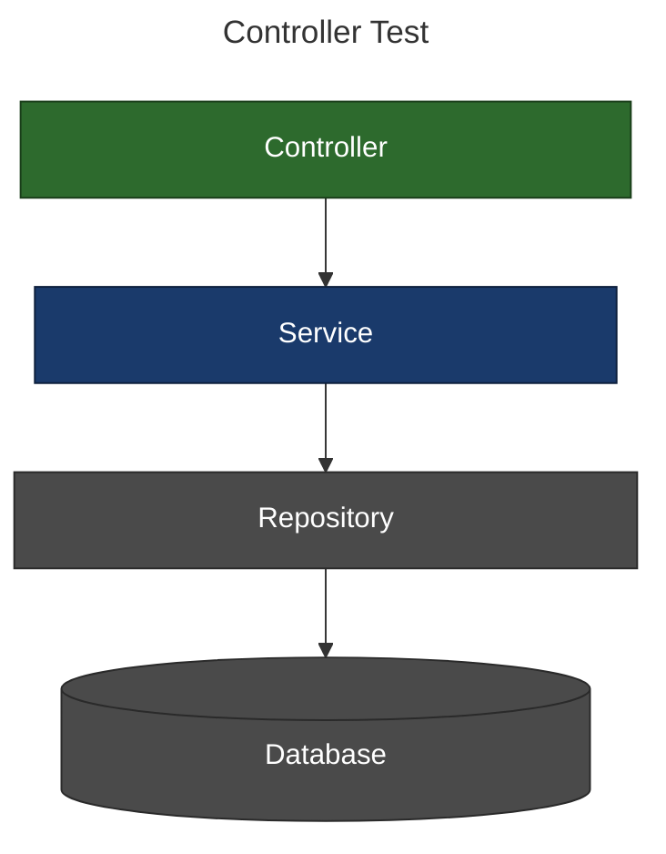
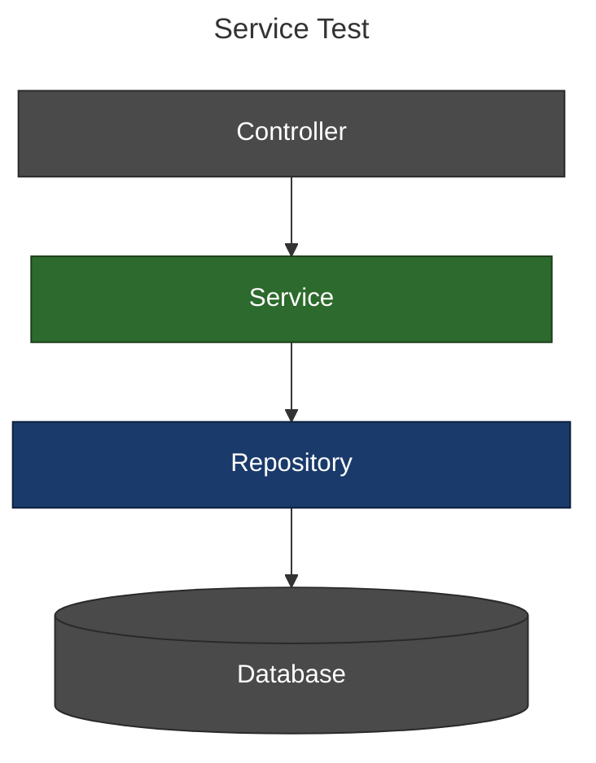
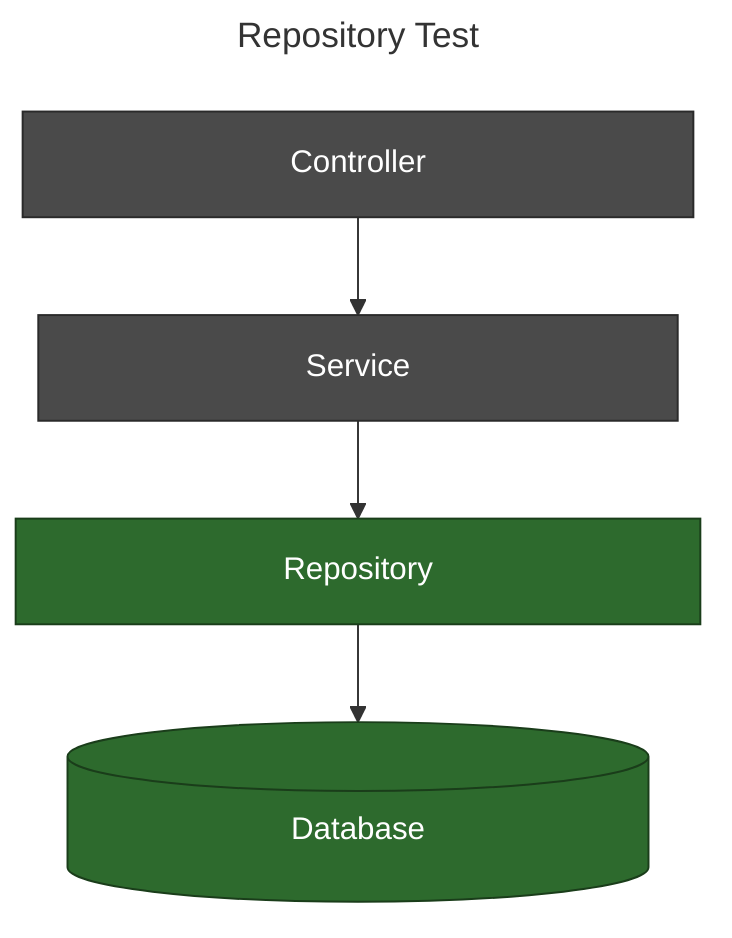
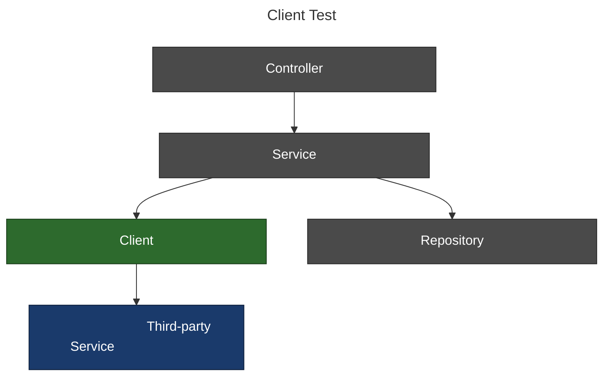

# spring-boot-test

A Claude Code plugin that shapes the test architecture, framework conventions, and maintainability patterns for Spring Boot services — not just generates test code.

It applies the [Practical Test Pyramid](https://martinfowler.com/articles/practical-test-pyramid.html) end-to-end: picking the right test type for each class, enforcing consistent structure across the codebase, and establishing conventions (naming, fixture scope, mock boundaries) that keep the test suite easy to maintain as it grows.

Two skills are included — one for Kotlin projects and one for Java projects. Claude selects the right skill automatically based on the language it detects in your project. Both skills also handle mixed Kotlin+Java modules and detect the actual test framework from your build file.

🟢 **Green** = layer under test &nbsp;&nbsp;|&nbsp;&nbsp; 🔵 **Blue** = layer being mocked &nbsp;&nbsp;|&nbsp;&nbsp; ⚫ **Gray** = not directly involved

<table>
<tr>
<td>



</td>
<td>



</td>
<td>



</td>
</tr>
<tr>
<td colspan="3">



</td>
</tr>
</table>

## Skills

| Skill | Language | Stack |
|-------|----------|-------|
| `spring-boot-kotlin-test` | Kotlin (Kotest+MockK) | Kotest · MockK · TestContainers · WireMock |
| `spring-boot-kotlin-test` | Kotlin (JUnit 5+Mockito) | JUnit 5 · Mockito · AssertJ · TestContainers · WireMock |
| `spring-boot-java-test` | Java | JUnit 5 · Mockito · AssertJ · TestContainers · WireMock |

Mixed Kotlin+Java projects: the class under test determines the skill — `.kt` classes use `spring-boot-kotlin-test`, `.java` classes use `spring-boot-java-test`.

## What it generates

| Class type | Test type | Kotlin + Kotest+MockK | Kotlin + JUnit5+Mockito | Java |
|---|---|---|---|---|
| REST controller | `@WebMvcTest` slice (behaviour + auth) | Kotest · `@MockkBean` · Spring Security Test | JUnit 5 · `@MockitoBean` · Spring Security Test | JUnit 5 · `@MockitoBean` · Spring Security Test |
| Service | Pure unit test, no Spring context | Kotest · MockK | JUnit 5 · Mockito · AssertJ | JUnit 5 · Mockito · AssertJ |
| JPA repository | Integration test against real Postgres | Kotest · TestContainers · `@DataJpaTest` | JUnit 5 · TestContainers · `@DataJpaTest` | JUnit 5 · TestContainers · `@DataJpaTest` |
| Outbound HTTP client | WireMock (`@WireMockTest`) | Kotest · WireMock | JUnit 5 · WireMock | JUnit 5 · WireMock |
| Any | Parameterized test | Kotest `withData` or `forEach` | `@ParameterizedTest` · `@MethodSource` / `@CsvSource` | `@ParameterizedTest` · `@MethodSource` / `@CsvSource` |

## Usage

Just ask Claude naturally — it triggers automatically and picks the right skill for your language:

```
Write a test for UserService.createUser()
Add tests for OrderRepository
What kind of test should I write for this controller?
```
